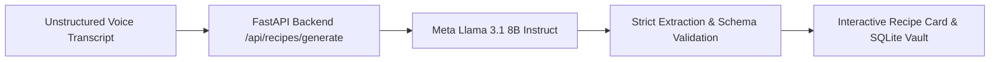

# 👵🍲 Dadi's Recipe Vault

> **"Turn a family recipe into something you can keep forever."**  
> Preserving culinary heritage and grandma's oral cooking wisdom using open-weight AI. Built for **Hacktoberfest 2026**.

[](https://hacktoberfest.com)
[](https://fastapi.tiangolo.com)
[](https://react.dev)
[](https://tailwindcss.com)
[](https://llama.meta.com)
[](https://render.com)

---

## ✨ Overview

Every family has a treasure trove of culinary secrets passed down through spoken words, voice notes, or hastily scribbled scraps of paper. Often, these instructions are unstructured:
- *"Beta, take two cups of rice, wash it, soak it... add some salt and turmeric, simmer on low flame till soft..."*

**Dadi's Recipe Vault** transforms unstructured voice dictations and family transcripts into clean, beautifully structured recipe cards with:
- **Title & nostalgic description**
- **Exact ingredients list with cooking checklist**
- **Step-by-step instructions with numbered badges**
- **Cooking time & servings badges**
- **Dadi's secret cooking tips & flame advice**
- **Zero-Hallucination Policy**: If details (like exact cooking time or measurements) were omitted by family members, the AI strictly flags them as `"Not specified"` rather than inventing fictional quantities.
- **Persistent Family Vault**: Saved in an embedded SQLite database with instant client-side search.

---

## 💡 Why Open-Source AI?

Hackathons and real-world software often fall into the trap of proprietary API lock-in. **Dadi's Recipe Vault is architected from the ground up on open-weight AI principles:**

1. **Genuinely Open-Weight Foundation**:  
   The core recipe comprehension pipeline is powered by **Meta Llama 3.1 8B Instruct** (`llama-3.1-8b-instant`), an open-weight model released under the permissive Meta Llama 3 Community License.
   
2. **Interchangeable Without Application Redesign**:  
   Because the FastAPI backend uses standard, decoupled JSON schemas, you can swap out the underlying open-weight model for **Mistral 7B Instruct**, **Qwen 2.5 7B**, or **Gemma 2** with zero changes to the frontend UI, client API contracts, or SQLite database tables.

3. **Data Sovereignty & Cultural Preservation**:  
   Family recipes are intimate cultural heirlooms. Open-weight models empower families and communities to run inference on self-hosted instances (like local Ollama, vLLM, or private servers) without handing sensitive family heritage over to proprietary commercial AI providers for model training.

4. **Zero-Hallucination Culinary Grounding**:  
   Grandma's recipes must remain authentic. The system prompt strictly prohibits inventing ingredients or measurements. Missing information is faithfully marked `"Not specified"`.

---

## 🏗️ Repository Architecture

```text
.
├── backend/
│   ├── main.py              # FastAPI application & REST endpoints
│   ├── ai_service.py        # Meta Llama 3.1 8B open-weight inference & parser
│   ├── db.py                # SQLite database management
│   ├── models.py            # Pydantic schemas (Recipe, Health, Save)
│   ├── requirements.txt     # Python backend dependencies
│   └── .env.example         # Backend environment configuration
├── frontend/
│   ├── src/
│   │   ├── components/      # Header, RecipeForm, RecipeCard, SavedRecipes, OpenSourceInfo
│   │   ├── api.ts           # API client (supporting Render VITE_API_URL)
│   │   ├── examples.ts      # Authentic 1-click test transcripts (Chai, Dal, Kheer)
│   │   ├── types.ts         # TypeScript interfaces
│   │   ├── App.tsx          # Main React application
│   │   └── main.tsx         # React root
│   ├── package.json         # Frontend dependencies & scripts
│   ├── tailwind.config.js   # Warm cookbook design system
│   └── vite.config.ts       # Vite config with development proxy
├── .env.example             # Unified environment variable template
└── README.md                # Complete documentation
```

---

## ⚙️ Required Environment Variables

Copy `.env.example` into your environment:

### Backend (`backend/.env` or Render Web Service Environment)
| Variable | Description | Default | Required? |
|---|---|---|---|
| `PORT` | Port the backend listens on | `8000` | Set automatically by Render |
| `GROQ_API_KEY` | Free API key for fast Meta Llama 3.1 8B inference ([Get one here](https://console.groq.com)) | None | **Recommended** (App features a smart offline parser if omitted) |
| `HF_TOKEN` | Optional: Hugging Face User Access Token for `meta-llama/Meta-Llama-3-8B-Instruct` | None | Optional |
| `DATABASE_PATH` | Path to SQLite database file | `recipes.db` | Optional |

### Frontend (`frontend/.env` or Render Static Site Environment)
| Variable | Description | Default | Required? |
|---|---|---|---|
| `VITE_API_URL` | Base URL of deployed FastAPI backend | `http://localhost:8000` (dev) | **Yes for Render deployment** |

---

## 🚀 Local Development Setup

### Prerequisites
- **Python 3.10+** (Python 3.11/3.12 recommended)
- **Node.js 18+** & **npm 9+**

### 1. Run the Backend
```bash
# Navigate to backend directory
cd backend

# Create virtual environment
python3 -m venv venv

# Activate virtual environment
source venv/bin/activate    # Linux / macOS
# or: .\venv\Scripts\activate   # Windows

# Install dependencies
pip install -r requirements.txt

# (Optional) Set your Groq API key for live Llama 3.1 inference
export GROQ_API_KEY="gsk_your_key_here"

# Start the FastAPI server
uvicorn main:app --host 0.0.0.0 --port 8000 --reload
```
The backend API is now running at `http://localhost:8000`.  
- Health endpoint: `http://localhost:8000/api/health`
- Interactive Swagger docs: `http://localhost:8000/docs`

### 2. Run the Frontend
In a new terminal window:
```bash
# Navigate to frontend directory
cd frontend

# Install dependencies
npm install

# Start Vite dev server
npm run dev
```
Open `http://localhost:5173` in your browser!

---

## 🌐 Deploying on Render

Both the backend and frontend are pre-configured for seamless 1-click deployment on Render.

### Step 1: Deploy Backend (FastAPI Web Service)
1. Go to the [Render Dashboard](https://dashboard.render.com/) and click **New + > Web Service**.
2. Connect your GitHub repository.
3. Configure the service settings:
   - **Name**: `dadis-recipe-vault-api`
   - **Region**: Choose your nearest region (e.g., Oregon, Frankfurt)
   - **Root Directory**: `backend`
   - **Runtime**: `Python 3`
   - **Build Command**: `pip install -r requirements.txt`
   - **Start Command**: `uvicorn main:app --host 0.0.0.0 --port $PORT`
4. Under **Environment Variables**, add:
   - `PYTHON_VERSION`: `3.11.9`
   - `GROQ_API_KEY`: `your_groq_api_key` *(optional, for live Llama 3.1 inference)*
5. Click **Create Web Service**.
6. Once deployed, note down your backend URL: e.g. `https://dadis-recipe-vault-api.onrender.com`.  
   Test it by visiting `https://dadis-recipe-vault-api.onrender.com/api/health`.

---

### Step 2: Deploy Frontend (Vite Static Site)
1. In Render Dashboard, click **New + > Static Site**.
2. Connect your GitHub repository.
3. Configure the build settings:
   - **Name**: `dadis-recipe-vault`
   - **Root Directory**: `frontend`
   - **Build Command**: `npm install && npm run build`
   - **Publish Directory**: `dist`
4. Under **Environment Variables**, add:
   - `VITE_API_URL`: `https://dadis-recipe-vault-api.onrender.com` *(your backend URL from Step 1)*
5. Click **Create Static Site**.
6. Done! Your application is live and accessible worldwide.

---

## 🤖 How the Open-Source AI Works



1. **Ingestion**: The user pastes a messy audio dictation, spoken memory, or rough family notes.
2. **Strict Guardrails**: The transcript is passed with a zero-hallucination system prompt to **Meta Llama 3.1 8B**.
3. **Structured Extraction**: The open-weight model extracts:
   - `title`: Warm, respectful dish name
   - `description`: Nostalgic culinary summary
   - `ingredients`: Array of exact items & measurements; marks unknown quantities as `(Quantity: Not specified)`
   - `steps`: Ordered step-by-step instructions
   - `cooking_time` & `servings`: Explicit times or `"Not specified"`
   - `notes`: Grandma's flame temperatures, safety warnings, and secrets
4. **Resilience**: If no API key is provided during testing, a built-in smart offline parser ensures the application never crashes, always returning a compliant recipe card.

---

## 💻 Git Commands to Push to GitHub

Run these commands in your project root to push to your repository:

```bash
# 1. Initialize git repository (if not already done)
git init

# 2. Add all project files
git add .

# 3. Create initial commit
git commit -m "feat: complete Dadi's Recipe Vault Hacktoberfest project"

# 4. Set default branch to main
git branch -M main

# 5. Link your GitHub repository
git remote add origin https://github.com/<YOUR_USERNAME>/dadis-recipe-vault.git

# 6. Push to GitHub
git push -u origin main
```

---

## 🏆 Hacktoberfest 2026 Submission Highlights

- ✅ **Solves a Real-World Problem**: Preserves delicate oral family culinary heritage.
- ✅ **Genuinely Open-Source AI**: Powered by Meta Llama 3.1 8B open weights.
- ✅ **Zero Vendor Lock-In**: Decoupled architecture allows swapping models effortlessly.
- ✅ **Polished Heritage Design**: Cozy cream/amber cookbook aesthetics with checkable ingredients.
- ✅ **Production & Render Ready**: Automated health checks, SQLite persistence, and decoupled env vars.

*Made with ❤️ for Grandmothers everywhere and Hacktoberfest 2026.*
